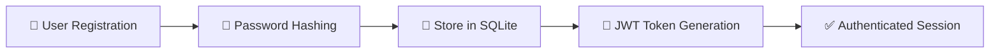
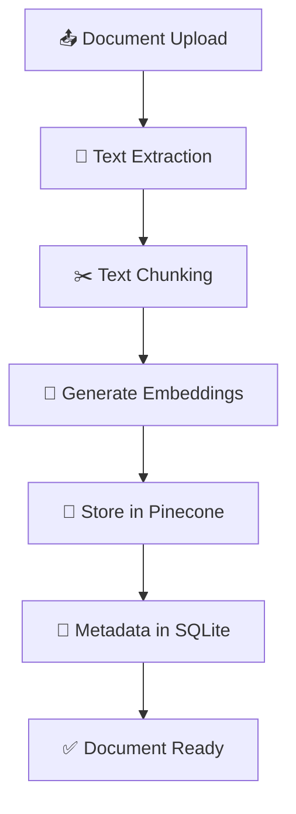
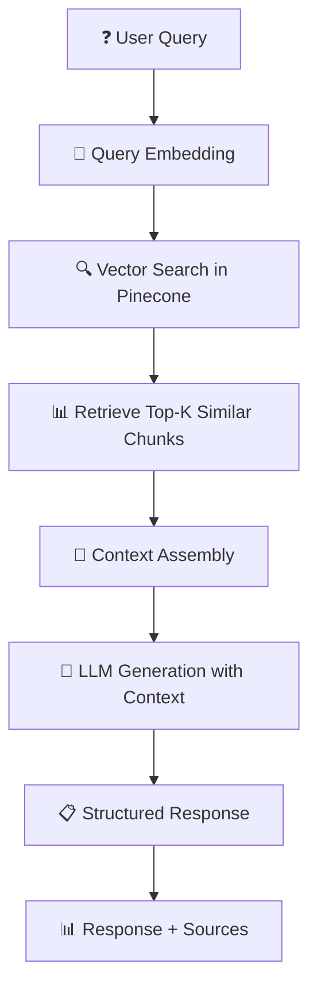

# 🤖 RAG Application with FastAPI, Pinecone, and LangChain

<div align="center">


*A comprehensive Retrieval-Augmented Generation (RAG) application built with FastAPI, featuring document storage, vector search using Pinecone, and LLM-powered question answering.*

</div>

---

## 🌟 Features

<table>
<tr>
<td width="50%">

### 🔐 **Security & Authentication**
- JWT-based authentication
- Password hashing with bcrypt
- User-specific document isolation
- Input validation with Pydantic

</td>
<td width="50%">

### 📄 **Document Management**
- Upload and store documents
- Metadata management
- Document versioning
- User-specific document access

</td>
</tr>
<tr>
<td width="50%">

### 🔍 **Advanced Search**
- Vector-based semantic search
- Pinecone integration
- Contextual retrieval
- Similarity scoring

</td>
<td width="50%">

### 🤖 **AI-Powered Q&A**
- RAG pipeline implementation
- LLM integration with Groq
- Context-aware responses
- Multi-document querying

</td>
</tr>
</table>

---

## 🛠️ Tech Stack

<div align="center">

| Category | Technology | Purpose |
|----------|------------|---------|
| **Backend** | FastAPI, Python 3.11+ | High-performance async API |
| **Database** | SQLite + SQLAlchemy | User and document metadata |
| **Vector DB** | Pinecone | Semantic search and embeddings |
| **Embeddings** | Hugging Face Transformers | Text vectorization |
| **LLM** | Groq API | Question answering |
| **Authentication** | JWT + bcrypt | Secure user management |
| **Logging** | Loguru | Structured application logging |

</div>

---

## 📸 Application Screenshots

### 🎯 Authentication & User Management
<div align="center">
<table>
<tr>
<td align="center" width="33%">
<h4>🔐 User Registration</h4>
<br>
<i>📷 [Photo 1: User Registration Interface]</i>
<br><br>
<em>Secure user registration with email validation and password strength requirements</em>
</td>
<td align="center" width="33%">
<h4>🚪 Login Portal</h4>
<br>
<i>📷 [Photo 2: Login Interface]</i>
<br><br>
<em>JWT-based authentication system with token management</em>
</td>
<td align="center" width="33%">
<h4>👤 User Dashboard</h4>
<br>
<i>📷 [Photo 3: User Dashboard]</i>
<br><br>
<em>Personalized dashboard showing user documents and activity</em>
</td>
</tr>
</table>
</div>

### 📄 Document Management System
<div align="center">
<table>
<tr>
<td align="center" width="50%">
<h4>📤 Document Upload</h4>
<br>
<i>📷 [Photo 4: Document Upload Interface]</i>
<br><br>
<em>Drag-and-drop document upload with progress tracking and format validation</em>
</td>
<td align="center" width="50%">
<h4>📋 Document Library</h4>
<br>
<i>📷 [Photo 5: Document Management]</i>
<br><br>
<em>Comprehensive document library with search, filter, and organization features</em>
</td>
</tr>
</table>
</div>

### 🗄️ Database Management
<div align="center">
<table>
<tr>
<td align="center" width="50%">
<h4>🔍 SQLite Database</h4>
<br>
<i>📷 [Photo 6: SQLite Database View]</i>
<br><br>
<em>SQLite database showing user tables, document metadata, and relationships</em>
</td>
<td align="center" width="50%">
<h4>🌲 Pinecone Vector Database</h4>
<br>
<i>📷 [Photo 7: Pinecone Dashboard]</i>
<br><br>
<em>Pinecone vector database with embeddings, indexes, and vector statistics</em>
</td>
</tr>
</table>
</div>

### 🤖 RAG Query System
<div align="center">
<table>
<tr>
<td align="center" width="50%">
<h4>💬 Question Interface</h4>
<br>
<i>📷 [Photo 8: Query Interface]</i>
<br><br>
<em>Interactive query interface with context selection and parameter tuning</em>
</td>
<td align="center" width="50%">
<h4>📊 AI Response & Analytics</h4>
<br>
<i>📷 [Photo 9: Response Dashboard]</i>
<br><br>
<em>AI-generated responses with source attribution, confidence scores, and analytics</em>
</td>
</tr>
</table>
</div>

---

## 🚀 Quick Start

### Prerequisites
```bash
✅ Python 3.11 or higher
✅ Pinecone account and API key
✅ Groq API key
✅ Git
```

### 1️⃣ Installation
```bash
# Clone the repository
git clone <repository-url>
cd rag_app

# Create virtual environment
python -m venv venv12
source venv/bin/activate  # Windows: venv\Scripts\activate

# Install dependencies
pip install -r requirements.txt
```

### 2️⃣ Environment Setup
Create a `.env` file:
```env
# Database Configuration
DATABASE_URL=sqlite:///./rag_app.db

# JWT Security
SECRET_KEY=your-super-secret-key-here
ALGORITHM=HS256
ACCESS_TOKEN_EXPIRE_MINUTES=30

# Pinecone Vector Database
PINECONE_API_KEY=your-pinecone-api-key
PINECONE_ENVIRONMENT=us-west1-gcp-free
PINECONE_INDEX_NAME=rag-documents

# Groq LLM API
GROQ_API_KEY=your-groq-api-key

# Optional: Hugging Face
HUGGINGFACE_API_TOKEN=your-huggingface-token

# Logging Configuration
LOG_LEVEL=INFO
LOG_FILE=logs/app.log
```

### 3️⃣ Launch Application
```bash
# Development mode
uvicorn app.main:app --reload --host 0.0.0.0 --port 8000

# Or using the provided script
python run_docs.py
```

---

## 📋 API Documentation

<div align="center">

### 🌐 Access Points
| Service | URL | Description |
|---------|-----|-------------|
| **Swagger UI** | `http://localhost:8000/docs` | Interactive API documentation |
| **ReDoc** | `http://localhost:8000/redoc` | Clean API documentation |
| **OpenAPI** | `http://localhost:8000/openapi.json` | API specification |

</div>

### 🔗 API Endpoints

#### 🔐 Authentication
```http
POST /api/v1/auth/register    # Create new user account
POST /api/v1/auth/login       # Authenticate and get token
```

#### 📄 Document Management
```http
POST   /api/v1/documents/           # Create new document
GET    /api/v1/documents/           # List user documents
GET    /api/v1/documents/{id}       # Get specific document
DELETE /api/v1/documents/{id}       # Delete document
POST   /api/v1/documents/upload     # Upload document file
```

#### 🔍 Query & Search
```http
POST /api/v1/query/        # RAG-powered question answering
POST /api/v1/query/search  # Semantic document search
```

---

## 🏗️ Project Architecture

```
rag_app/
├── 📁 app/
│   ├── 📄 __init__.py
│   ├── 🚀 main.py                 # FastAPI application entry point
│   │
│   ├── 📁 config/                 # Configuration management
│   │   ├── 📄 __init__.py
│   │   └── ⚙️ settings.py         # Environment and app settings
│   │
│   ├── 📁 core/                   # Core application utilities
│   │   ├── 📄 __init__.py
│   │   ├── 🔐 auth.py             # JWT authentication logic
│   │   ├── 🗄️ database.py         # Database connection and session
│   │   └── 📝 logging.py          # Structured logging configuration
│   │
│   ├── 📁 models/                 # SQLAlchemy database models
│   │   ├── 📄 __init__.py
│   │   ├── 👤 user.py             # User model and relationships
│   │   └── 📄 document.py         # Document model and metadata
│   │
│   ├── 📁 schemas/                # Pydantic data validation schemas
│   │   ├── 📄 __init__.py
│   │   ├── 🔐 auth.py             # Authentication request/response schemas
│   │   ├── 📄 document.py         # Document CRUD schemas
│   │   └── 🔍 query.py            # Query and search schemas
│   │
│   ├── 📁 services/               # Business logic and external services
│   │   ├── 📄 __init__.py
│   │   ├── 🔐 auth_service.py     # User authentication service
│   │   ├── 🧠 embedding_service.py # Text embedding generation
│   │   ├── 🌲 pinecone_service.py # Vector database operations
│   │   ├── 🤖 llm_service.py      # Language model integration
│   │   └── 🔄 rag_service.py      # RAG pipeline orchestration
│   │
│   ├── 📁 api/                    # API route handlers
│   │   ├── 📄 __init__.py
│   │   ├── 🔐 auth.py             # Authentication endpoints
│   │   ├── 📄 documents.py        # Document management endpoints
│   │   └── 🔍 query.py            # Query and search endpoints
│   │
│   └── 📁 utils/                  # Helper utilities and tools
│       ├── 📄 __init__.py
│       └── 🛠️ helpers.py          # Common utility functions
│
├── 📋 requirements.txt            # Python dependencies
├── 🔧 .env.example               # Environment variables template
└── 📖 README.md                  # Project documentation
```

---

## 🔄 Application Flow

### 🎯 **Phase 1: User Authentication & Setup**


### 📄 **Phase 2: Document Processing Pipeline**


### 🔍 **Phase 3: RAG Query Processing**


### 🏗️ **Complete System Architecture Flow**

```
┌─────────────────┐    ┌─────────────────┐    ┌─────────────────┐
│   👤 Frontend    │    │  🚀 FastAPI      │    │  🗄️ Data Layer   │
│                 │    │                 │    │                 │
│ • User Interface│◄──►│ • Authentication│◄──►│ • SQLite DB     │
│ • Query Input   │    │ • API Endpoints │    │ • User Data     │
│ • Results View  │    │ • Request       │    │ • Document Meta │
│                 │    │   Validation    │    │                 │
└─────────────────┘    └─────────────────┘    └─────────────────┘
                                │
                                ▼
┌─────────────────┐    ┌─────────────────┐    ┌─────────────────┐
│  🧠 ML Services  │    │  🔄 RAG Engine   │    │  🌲 Vector DB    │
│                 │    │                 │    │                 │
│ • Embedding     │◄──►│ • Query         │◄──►│ • Pinecone      │
│   Generation    │    │   Processing    │    │ • Vector Search │
│ • Text          │    │ • Context       │    │ • Embeddings    │
│   Processing    │    │   Retrieval     │    │   Storage       │
└─────────────────┘    └─────────────────┘    └─────────────────┘
                                │
                                ▼
                       ┌─────────────────┐
                       │  🤖 LLM Service  │
                       │                 │
                       │ • Groq API      │
                       │ • Response      │
                       │   Generation    │
                       │ • Context       │
                       │   Integration   │
                       └─────────────────┘
```

---

## 🔧 Configuration & Customization

### 🧠 Embedding Model Configuration
```python
# Default: sentence-transformers/all-MiniLM-L6-v2
# Change in app/config/settings.py
embedding_model: str = "sentence-transformers/your-preferred-model"
```

### 🌲 Pinecone Index Settings
- **Dimension**: 384 (for all-MiniLM-L6-v2)
- **Metric**: cosine similarity
- **Environment**: Configurable via environment variables

### 🤖 LLM Model Selection
```python
# Default: llama3-8b-8192
# Modify in app/services/llm_service.py
```

---

## 🛡️ Security Features

<div align="center">
<table>
<tr>
<td width="50%">

### 🔐 **Authentication Security**
- JWT token-based authentication
- bcrypt password hashing
- Token expiration management
- Secure session handling

</td>
<td width="50%">

### 🛡️ **Data Protection**
- User-specific document isolation
- Input validation with Pydantic
- CORS configuration
- SQL injection prevention

</td>
</tr>
</table>
</div>

---

## 📊 Monitoring & Logging

### 📝 Structured Logging with Loguru
- **Console Output**: Colored, formatted logs
- **File Rotation**: 10MB files, 30-day retention
- **Log Levels**: Configurable (DEBUG, INFO, WARNING, ERROR)
- **Automatic Directory Creation**: `logs/` folder management

### 🔍 Error Handling
- Comprehensive exception handling
- Structured error responses
- Detailed debugging information
- User-friendly error messages

---

## 🚀 Deployment

### 🐳 Docker Deployment
```bash
# Build the Docker image
docker build -t rag-app .

# Run with docker-compose
docker-compose up -d
```

### 🔒 Production Security Checklist
- [ ] Generate secure `SECRET_KEY`
- [ ] Configure production database
- [ ] Set up proper CORS origins
- [ ] Enable HTTPS/SSL
- [ ] Configure rate limiting
- [ ] Set up monitoring and alerts

---

## 🐛 Troubleshooting

<details>
<summary><b>🌲 Pinecone Connection Issues</b></summary>

- Verify API key and environment settings
- Check index name configuration
- Ensure Pinecone plan limits aren't exceeded
- Validate network connectivity

</details>

<details>
<summary><b>🧠 Embedding Model Problems</b></summary>

- First run downloads model (may take time)
- Ensure sufficient disk space (2-3GB)
- Check internet connection for downloads
- Verify model compatibility

</details>

<details>
<summary><b>🗄️ Database Issues</b></summary>

- Check SQLite file permissions
- Verify `DATABASE_URL` format
- Run database migrations if needed
- Ensure disk space availability

</details>

<details>
<summary><b>🔐 Authentication Problems</b></summary>

- Verify JWT secret key configuration
- Check token expiration settings
- Ensure proper header format: `Authorization: Bearer <token>`
- Validate user credentials

</details>

---

## 🤝 Contributing

We welcome contributions! Please follow these steps:

1. 🍴 **Fork** the repository
2. 🌿 **Create** a feature branch (`git checkout -b feature/amazing-feature`)
3. ✨ **Make** your changes
4. 🧪 **Add** tests if applicable
5. 📝 **Commit** your changes (`git commit -m 'Add some amazing feature'`)
6. 🚀 **Push** to the branch (`git push origin feature/amazing-feature`)
7. 🎯 **Open** a Pull Request

---

## 📄 License

This project is licensed under the **MIT License** - see the [LICENSE](LICENSE) file for details.

---

## 💬 Support & Community

<div align="center">

### 🆘 Getting Help

| Resource | Description |
|----------|-------------|
| 📖 **Documentation** | Check the API docs at `/docs` |
| 🐛 **Issues** | Report bugs in GitHub Issues |
| 💡 **Discussions** | Join community discussions |
| 📧 **Email** | Contact for enterprise support |

### 🌟 Show Your Support

If this project helped you, please consider giving it a ⭐ on GitHub!

</div>

---

<div align="center">

**Built with ❤️ by the RAG App Team**

*Empowering intelligent document interactions through advanced AI*

</div>