# 🤖 RAG Application with FastAPI, Pinecone, and LangChain

<div align="center">


*A comprehensive Retrieval-Augmented Generation (RAG) application built with FastAPI, featuring document storage, vector search using Pinecone, and LLM-powered question answering.*

</div>

---

## 🌟 Features

<table>
<tr>
<td width="50%">

### 🔐 **Security & Authentication**
- JWT-based authentication
- Password hashing with bcrypt
- User-specific document isolation
- Input validation with Pydantic

</td>
<td width="50%">

### 📄 **Document Management**
- Upload and store documents
- Metadata management
- Document versioning
- User-specific document access

</td>
</tr>
<tr>
<td width="50%">

### 🔍 **Advanced Search**
- Vector-based semantic search
- Pinecone integration
- Contextual retrieval
- Similarity scoring

</td>
<td width="50%">

### 🤖 **AI-Powered Q&A**
- RAG pipeline implementation
- LLM integration with Groq
- Context-aware responses
- Multi-document querying

</td>
</tr>
</table>

---

## 🛠️ Tech Stack

<div align="center">

| Category | Technology | Purpose |
|----------|------------|---------|
| **Backend** | FastAPI, Python 3.11+ | High-performance async API |
| **Database** | SQLite + SQLAlchemy | User and document metadata |
| **Vector DB** | Pinecone | Semantic search and embeddings |
| **Embeddings** | Hugging Face Transformers | Text vectorization |
| **LLM** | Groq API | Question answering |
| **Authentication** | JWT + bcrypt | Secure user management |
| **Logging** | Loguru | Structured application logging |

</div>

---

## 📸 Application Screenshots & Demo

### 🎯 Authentication System (React Frontend)
<div align="center">
<table>
<tr>
<td align="center" width="50%">
<h4>🚪 User Login</h4>
<br>

<br><br>
<em>Clean and intuitive login interface with email/password authentication and JWT token generation</em>
</td>
<td align="center" width="50%">
<h4>📝 User Registration</h4>
<br>

<br><br>
<em>Secure user registration with form validation, password strength requirements, and instant feedback</em>
</td>
</tr>
</table>
</div>

### 🗄️ Database Management & Backend
<div align="center">
<table>
<tr>
<td align="center" width="50%">
<h4>💾 SQLite Database</h4>
<br>

<br><br>
<em>SQLite database structure showing user tables, document metadata, relationships, and stored data</em>
</td>
<td align="center" width="50%">
<h4>🌲 Pinecone Vector Database</h4>
<br>

<br><br>
<em>Pinecone vector database displaying uploaded documents, embeddings, and vector search capabilities</em>
</td>
</tr>
</table>
</div>

### 📄 Document Management System (React Frontend)
<div align="center">
<table>
<tr>
<td align="center" width="50%">
<h4>📋 My Documents Dashboard</h4>
<br>

<br><br>
<em>RAG document system dashboard after login, showing user's document library and management options</em>
</td>
<td align="center" width="50%">
<h4>📤 Create New Document</h4>
<br>

<br><br>
<em>Document creation interface with title, content fields, and upload functionality</em>
</td>
</tr>
</table>
</div>

### 📚 Document Library & Upload System
<div align="center">
<table>
<tr>
<td align="center" width="100%">
<h4>📁 Uploaded Documents Library</h4>
<br>

<br><br>
<em>Comprehensive view of all uploaded documents with metadata, timestamps, and management actions</em>
</td>
</tr>
</table>
</div>

### 🤖 RAG Query & AI Response System (React Frontend)
<div align="center">
<table>
<tr>
<td align="center" width="50%">
<h4>🔍 Document Query Interface</h4>
<br>

<br><br>
<em>Interactive query interface where users can ask questions about their uploaded documents</em>
</td>
<td align="center" width="50%">
<h4>🧠 AI-Powered Responses</h4>
<br>

<br><br>
<em>Intelligent AI responses with context from documents, source attribution, and confidence indicators</em>
</td>
</tr>
</table>
</div>

---

## 🚀 Quick Start

### Prerequisites
```bash
✅ Python 3.11 or higher
✅ Pinecone account and API key
✅ Groq API key
✅ Git
```

### 1️⃣ Installation
```bash
# Clone the repository
git clone <repository-url>
cd rag_app

# Create virtual environment
python -m venv venv12
source venv/bin/activate  # Windows: venv\Scripts\activate

# Install dependencies
pip install -r requirements.txt
```

### 2️⃣ Environment Setup
Create a `.env` file:
```env
# Database Configuration
DATABASE_URL=sqlite:///./rag_app.db

# JWT Security
SECRET_KEY=your-super-secret-key-here
ALGORITHM=HS256
ACCESS_TOKEN_EXPIRE_MINUTES=30

# Pinecone Vector Database
PINECONE_API_KEY=your-pinecone-api-key
PINECONE_ENVIRONMENT=us-west1-gcp-free
PINECONE_INDEX_NAME=rag-documents

# Groq LLM API
GROQ_API_KEY=your-groq-api-key

# Optional: Hugging Face
HUGGINGFACE_API_TOKEN=your-huggingface-token

# Logging Configuration
LOG_LEVEL=INFO
LOG_FILE=logs/app.log
```

### 3️⃣ Launch Application
```bash
# Development mode
uvicorn app.main:app --reload --host 0.0.0.0 --port 8000

# Or using the provided script
python run_docs.py
```

---

## 📋 API Documentation

<div align="center">

### 🌐 Access Points
| Service | URL | Description |
|---------|-----|-------------|
| **Swagger UI** | `http://localhost:8000/docs` | Interactive API documentation |
| **ReDoc** | `http://localhost:8000/redoc` | Clean API documentation |
| **OpenAPI** | `http://localhost:8000/openapi.json` | API specification |

</div>

### 🔗 API Endpoints

#### 🔐 Authentication
```http
POST /api/v1/auth/register    # Create new user account
POST /api/v1/auth/login       # Authenticate and get token
```

#### 📄 Document Management
```http
POST   /api/v1/documents/           # Create new document
GET    /api/v1/documents/           # List user documents
GET    /api/v1/documents/{id}       # Get specific document
DELETE /api/v1/documents/{id}       # Delete document
POST   /api/v1/documents/upload     # Upload document file
```

#### 🔍 Query & Search
```http
POST /api/v1/query/        # RAG-powered question answering
POST /api/v1/query/search  # Semantic document search
```

---

## 🏗️ Project Architecture

```
rag_app/
├── 📁 app/
│   ├── 📄 __init__.py
│   ├── 🚀 main.py                 # FastAPI application entry point
│   │
│   ├── 📁 config/                 # Configuration management
│   │   ├── 📄 __init__.py
│   │   └── ⚙️ settings.py         # Environment and app settings
│   │
│   ├── 📁 core/                   # Core application utilities
│   │   ├── 📄 __init__.py
│   │   ├── 🔐 auth.py             # JWT authentication logic
│   │   ├── 🗄️ database.py         # Database connection and session
│   │   └── 📝 logging.py          # Structured logging configuration
│   │
│   ├── 📁 models/                 # SQLAlchemy database models
│   │   ├── 📄 __init__.py
│   │   ├── 👤 user.py             # User model and relationships
│   │   └── 📄 document.py         # Document model and metadata
│   │
│   ├── 📁 schemas/                # Pydantic data validation schemas
│   │   ├── 📄 __init__.py
│   │   ├── 🔐 auth.py             # Authentication request/response schemas
│   │   ├── 📄 document.py         # Document CRUD schemas
│   │   └── 🔍 query.py            # Query and search schemas
│   │
│   ├── 📁 services/               # Business logic and external services
│   │   ├── 📄 __init__.py
│   │   ├── 🔐 auth_service.py     # User authentication service
│   │   ├── 🧠 embedding_service.py # Text embedding generation
│   │   ├── 🌲 pinecone_service.py # Vector database operations
│   │   ├── 🤖 llm_service.py      # Language model integration
│   │   └── 🔄 rag_service.py      # RAG pipeline orchestration
│   │
│   ├── 📁 api/                    # API route handlers
│   │   ├── 📄 __init__.py
│   │   ├── 🔐 auth.py             # Authentication endpoints
│   │   ├── 📄 documents.py        # Document management endpoints
│   │   └── 🔍 query.py            # Query and search endpoints
│   │
│   └── 📁 utils/                  # Helper utilities and tools
│       ├── 📄 __init__.py
│       └── 🛠️ helpers.py          # Common utility functions
│
├── 📋 requirements.txt            # Python dependencies
├── 🔧 .env.example               # Environment variables template
└── 📖 README.md                  # Project documentation
```

---

## 🔄 Application Flow

### 🎯 **Phase 1: User Authentication & Setup**

```mermaid
graph LR
    A[👤 User Registration] --> B[🔐 Password Hashing]
    B --> C[💾 Store in SQLite]
    C --> D[🎫 JWT Token Generation]
    D --> E[✅ Authenticated Session]
```


### 📄 **Phase 2: Document Processing Pipeline**

```mermaid
graph TD
    A[📤 Document Upload] --> B[📝 Text Extraction]
    B --> C[✂️ Text Chunking]
    C --> D[🧠 Generate Embeddings]
    D --> E[🌲 Store in Pinecone]
    E --> F[💾 Metadata in SQLite]
    F --> G[✅ Document Ready]
```


### 🔍 **Phase 3: RAG Query Processing**

```mermaid
graph TD
    A[❓ User Query] --> B[🧠 Query Embedding]
    B --> C[🔍 Vector Search in Pinecone]
    C --> D[📊 Retrieve Top-K Similar Chunks]
    D --> E[📝 Context Assembly]
    E --> F[🤖 LLM Generation with Context]
    F --> G[📋 Structured Response]
    G --> H[📊 Response + Sources]
```


### 🏗️ **Complete System Architecture Flow**

```
┌─────────────────┐    ┌─────────────────┐    ┌─────────────────┐
│   👤 Frontend    │    │  🚀 FastAPI      │    │  🗄️ Data Layer   │
│                 │    │                 │    │                 │
│ • User Interface│◄──►│ • Authentication│◄──►│ • SQLite DB     │
│ • Query Input   │    │ • API Endpoints │    │ • User Data     │
│ • Results View  │    │ • Request       │    │ • Document Meta │
│                 │    │   Validation    │    │                 │
└─────────────────┘    └─────────────────┘    └─────────────────┘
                                │
                                ▼
┌─────────────────┐    ┌─────────────────┐    ┌─────────────────┐
│  🧠 ML Services  │    │  🔄 RAG Engine   │    │  🌲 Vector DB    │
│                 │    │                 │    │                 │
│ • Embedding     │◄──►│ • Query         │◄──►│ • Pinecone      │
│   Generation    │    │   Processing    │    │ • Vector Search │
│ • Text          │    │ • Context       │    │ • Embeddings    │
│   Processing    │    │   Retrieval     │    │   Storage       │
└─────────────────┘    └─────────────────┘    └─────────────────┘
                                │
                                ▼
                       ┌─────────────────┐
                       │  🤖 LLM Service  │
                       │                 │
                       │ • Groq API      │
                       │ • Response      │
                       │   Generation    │
                       │ • Context       │
                       │   Integration   │
                       └─────────────────┘
```

---

## 🔧 Configuration & Customization

### 🧠 Embedding Model Configuration
```python
# Default: sentence-transformers/all-MiniLM-L6-v2
# Change in app/config/settings.py
embedding_model: str = "sentence-transformers/your-preferred-model"
```

### 🌲 Pinecone Index Settings
- **Dimension**: 384 (for all-MiniLM-L6-v2)
- **Metric**: cosine similarity
- **Environment**: Configurable via environment variables

### 🤖 LLM Model Selection
```python
# Default: llama3-8b-8192
# Modify in app/services/llm_service.py
```

---

## 🛡️ Security Features

<div align="center">
<table>
<tr>
<td width="50%">

### 🔐 **Authentication Security**
- JWT token-based authentication
- bcrypt password hashing
- Token expiration management
- Secure session handling

</td>
<td width="50%">

### 🛡️ **Data Protection**
- User-specific document isolation
- Input validation with Pydantic
- CORS configuration
- SQL injection prevention

</td>
</tr>
</table>
</div>

---

## 📊 Monitoring & Logging

### 📝 Structured Logging with Loguru
- **Console Output**: Colored, formatted logs
- **File Rotation**: 10MB files, 30-day retention
- **Log Levels**: Configurable (DEBUG, INFO, WARNING, ERROR)
- **Automatic Directory Creation**: `logs/` folder management

### 🔍 Error Handling
- Comprehensive exception handling
- Structured error responses
- Detailed debugging information
- User-friendly error messages

---

## 🚀 Deployment

### 🐳 Docker Deployment
```bash
# Build the Docker image
docker build -t rag-app .

# Run with docker-compose
docker-compose up -d
```

### 🔒 Production Security Checklist
- [ ] Generate secure `SECRET_KEY`
- [ ] Configure production database
- [ ] Set up proper CORS origins
- [ ] Enable HTTPS/SSL
- [ ] Configure rate limiting
- [ ] Set up monitoring and alerts

---

## 🐛 Troubleshooting

<details>
<summary><b>🌲 Pinecone Connection Issues</b></summary>

- Verify API key and environment settings
- Check index name configuration
- Ensure Pinecone plan limits aren't exceeded
- Validate network connectivity

</details>

<details>
<summary><b>🧠 Embedding Model Problems</b></summary>

- First run downloads model (may take time)
- Ensure sufficient disk space (2-3GB)
- Check internet connection for downloads
- Verify model compatibility

</details>

<details>
<summary><b>🗄️ Database Issues</b></summary>

- Check SQLite file permissions
- Verify `DATABASE_URL` format
- Run database migrations if needed
- Ensure disk space availability

</details>

<details>
<summary><b>🔐 Authentication Problems</b></summary>

- Verify JWT secret key configuration
- Check token expiration settings
- Ensure proper header format: `Authorization: Bearer <token>`
- Validate user credentials

</details>

---

## 🤝 Contributing

We welcome contributions! Please follow these steps:

1. 🍴 **Fork** the repository
2. 🌿 **Create** a feature branch (`git checkout -b feature/amazing-feature`)
3. ✨ **Make** your changes
4. 🧪 **Add** tests if applicable
5. 📝 **Commit** your changes (`git commit -m 'Add some amazing feature'`)
6. 🚀 **Push** to the branch (`git push origin feature/amazing-feature`)
7. 🎯 **Open** a Pull Request

---


## 💬 Support & Community

<div align="center">

### 🆘 Getting Help

| Resource | Description |
|----------|-------------|
| 📖 **Documentation** | Check the API docs at `/docs` |
| 🐛 **Issues** | Report bugs in GitHub Issues |
| 💡 **Discussions** | Join community discussions |
| 📧 **Email** | Contact for enterprise support |

### 🌟 Show Your Support

If this project helped you, please consider giving it a ⭐ on GitHub!

</div>

---

<div align="center">

**Built with ❤️ by the Rajnish**

*Empowering intelligent document interactions through advanced AI*

</div>


## CHEATSHEET TO WORKFLOW
# 🎯 RAG Application Interview Preparation Guide

## 📋 Table of Contents
1. [Project Flow Explanation](#project-flow-explanation)
2. [Technical Architecture Questions](#technical-architecture-questions)
3. [RAG-Specific Questions](#rag-specific-questions)
4. [Database & Vector Store Questions](#database--vector-store-questions)
5. [Security & Authentication Questions](#security--authentication-questions)
6. [Performance & Scalability Questions](#performance--scalability-questions)
7. [Problem-Solving & Design Questions](#problem-solving--design-questions)
8. [Code Implementation Questions](#code-implementation-questions)

---

# 🚀 Project Flow Explanation

## 🎤 **"Walk me through your RAG application from start to finish"**

### **High-Level Overview (2-3 minutes)**
*"I built a comprehensive RAG (Retrieval-Augmented Generation) application that allows users to upload documents and ask intelligent questions about them. The system combines traditional database storage with modern vector databases and LLMs to provide accurate, context-aware responses."*

### **Detailed Technical Flow:**

#### **Phase 1: User Onboarding & Authentication** 🔐
```
1. User Registration:
   → Frontend (React) captures user details
   → FastAPI validates input using Pydantic schemas
   → Password hashed with bcrypt (salt rounds: 12)
   → User data stored in SQLite with unique constraints
   → JWT token generated with 30-minute expiration

2. User Login:
   → Credentials validated against hashed password
   → JWT token issued with user claims
   → Token stored in frontend for subsequent requests
   → All future requests include Authorization header
```

#### **Phase 2: Document Upload & Processing Pipeline** 📄
```
1. Document Upload:
   → React frontend handles file selection/drag-drop
   → FastAPI receives document via multipart/form-data
   → File validation (size, type, content)
   → Document metadata stored in SQLite

2. Text Processing:
   → Extract text content from document
   → Clean and preprocess text (remove special chars, normalize)
   → Split into chunks (512 tokens with 50-token overlap)
   → Each chunk maintains reference to parent document

3. Embedding Generation:
   → Use Sentence Transformers (all-MiniLM-L6-v2)
   → Generate 384-dimensional embeddings for each chunk
   → Batch processing for efficiency (32 chunks per batch)

4. Vector Storage:
   → Store embeddings in Pinecone with metadata
   → Index structure: {id, vector, metadata: {user_id, doc_id, chunk_text}}
   → Cosine similarity metric for search
```

#### **Phase 3: Query Processing & RAG Pipeline** 🔍
```
1. Query Input:
   → User enters question in React interface
   → Query validated and preprocessed
   → Generate embedding for user query

2. Semantic Search:
   → Query Pinecone with user's embedding
   → Retrieve top-K similar chunks (K=5 by default)
   → Filter by user_id for data isolation
   → Sort by similarity score

3. Context Assembly:
   → Rank retrieved chunks by relevance
   → Concatenate chunk texts with document sources
   → Create structured prompt with context and query
   → Limit total context to model's token limit

4. LLM Generation:
   → Send prompt to Groq API (Llama3-8b-8192)
   → Include system prompt for response format
   → Stream or batch response based on UI needs
   → Parse and format response with source attribution

5. Response Delivery:
   → Return structured response with:
     - Generated answer
     - Source documents
     - Confidence scores
     - Related chunks for transparency
```

#### **Phase 4: Security & Data Management** 🛡️
```
1. Access Control:
   → JWT validation middleware on all protected routes
   → User-specific data isolation in both SQLite and Pinecone
   → Rate limiting and input sanitization

2. Error Handling:
   → Comprehensive exception handling at each layer
   → Structured logging with Loguru
   → Graceful degradation for service failures
```

---

# ❓ Technical Interview Questions & Answers

## 🏗️ Technical Architecture Questions

### **Q1: Why did you choose FastAPI over Flask or Django?**
**Answer:**
*"I chose FastAPI for several key reasons:
- **Performance**: Built on Starlette and Pydantic, it's one of the fastest Python frameworks
- **Async Support**: Native async/await support crucial for handling multiple API calls (Pinecone, Groq)
- **Auto Documentation**: Automatic OpenAPI/Swagger generation saves development time
- **Type Safety**: Built-in Pydantic validation prevents runtime errors
- **Modern Python**: Leverages Python 3.6+ features like type hints
- **Easy Testing**: Built-in TestClient makes API testing straightforward"*

### **Q2: Explain your database architecture. Why both SQLite and Pinecone?**
**Answer:**
*"I implemented a hybrid database architecture:
- **SQLite**: Stores structured metadata (users, documents, relationships, timestamps)
  - ACID compliance for transactional data
  - Easy deployment and backup
  - Perfect for structured queries
- **Pinecone**: Stores vector embeddings for semantic search
  - Optimized for high-dimensional vector operations
  - Sub-second similarity search at scale
  - Managed service reduces operational overhead

This separation follows the principle of using the right tool for the right job - relational data in SQL, vectors in specialized vector DB."*

### **Q3: How do you handle the integration between multiple services (FastAPI, Pinecone, Groq)?**
**Answer:**
*"I implemented a service-oriented architecture with clear separation:
- **Service Layer Pattern**: Each external service has its own service class
- **Error Handling**: Try-catch blocks with exponential backoff for API failures
- **Connection Pooling**: Reuse HTTP connections where possible
- **Configuration Management**: Environment variables for all API keys and settings
- **Dependency Injection**: FastAPI's dependency system manages service instances
- **Async Operations**: Non-blocking calls to external APIs
- **Circuit Breaker Pattern**: Fail fast when services are down"*

## 🔍 RAG-Specific Questions

### **Q4: Explain how your RAG pipeline works. What are the key components?**
**Answer:**
*"My RAG pipeline has four main components:

1. **Retrieval System**:
   - Query encoding using same embedding model as documents
   - Semantic search in Pinecone vector database
   - Top-K retrieval with similarity thresholding
   - User-specific filtering for data privacy

2. **Context Assembly**:
   - Rank retrieved chunks by relevance score
   - Combine multiple chunks while respecting token limits
   - Add source attribution and metadata
   - Handle overlapping content deduplication

3. **Augmented Generation**:
   - Craft system prompt with retrieved context
   - Use Groq's Llama model for response generation
   - Include instructions for citing sources
   - Format output for user consumption

4. **Post-processing**:
   - Parse LLM response for structure
   - Add confidence scores and source links
   - Log interaction for analytics"*

### **Q5: How do you handle document chunking? What strategy did you use?**
**Answer:**
*"I implemented a semantic chunking strategy:
- **Chunk Size**: 512 tokens (balance between context and specificity)
- **Overlap**: 50 tokens to preserve context across boundaries
- **Boundaries**: Prefer sentence boundaries over arbitrary splits
- **Metadata Preservation**: Each chunk retains document ID, page number, section
- **Hierarchy**: Maintain document structure (headers, paragraphs)

This approach ensures:
- Coherent semantic units
- Sufficient context for embeddings
- Manageable size for LLM processing
- Reduced information loss at boundaries"*

### **Q6: How do you ensure the quality of retrieved context?**
**Answer:**
*"I implemented multiple quality assurance mechanisms:

1. **Similarity Thresholding**: Only return chunks above 0.7 cosine similarity
2. **Diversity Filtering**: Avoid returning too many similar chunks
3. **Relevance Ranking**: Combine similarity score with document recency
4. **Context Validation**: Check if retrieved chunks actually answer the query
5. **Source Attribution**: Always include document sources for transparency
6. **Feedback Loop**: Log user interactions to improve retrieval over time

Additionally, I use query expansion techniques and synonym matching to improve recall."*

## 🗄️ Database & Vector Store Questions

### **Q7: Why did you choose Pinecone over alternatives like FAISS or Chroma?**
**Answer:**
*"I chose Pinecone for several production-ready features:
- **Managed Service**: No infrastructure management overhead
- **Scalability**: Handles millions of vectors with consistent performance
- **Metadata Filtering**: Efficient user-based filtering for multi-tenancy
- **Real-time Updates**: Immediate availability of new embeddings
- **Reliability**: Built-in replication and backup
- **API-First**: Easy integration with FastAPI
- **Cost-Effective**: Pay-per-use model suitable for MVP

While FAISS is faster for local usage, Pinecone provides enterprise-grade reliability and scaling that would be complex to implement ourselves."*

### **Q8: How do you handle user data isolation in your vector database?**
**Answer:**
*"I implemented strict data isolation using multiple strategies:

1. **Metadata Filtering**: Every vector includes user_id in metadata
2. **Query Filtering**: All searches automatically filter by authenticated user
3. **Namespace Strategy**: Consider user-specific namespaces for complete isolation
4. **Access Control**: JWT validation before any vector operations
5. **Audit Logging**: Track all access attempts for security monitoring

This ensures users can only access their own documents while maintaining efficient search performance."*

### **Q9: Explain your embedding strategy. Why sentence-transformers?**
**Answer:**
*"I chose sentence-transformers/all-MiniLM-L6-v2 for several reasons:
- **Optimized for Similarity**: Specifically trained for semantic similarity tasks
- **Balanced Performance**: Good accuracy vs. speed tradeoff (384 dimensions)
- **Consistent Embeddings**: Same model for documents and queries ensures compatibility
- **Multilingual Support**: Handles various document types and languages
- **Memory Efficient**: Smaller model size suitable for deployment constraints
- **Community Support**: Well-documented with extensive examples

The 384-dimensional output provides sufficient semantic representation while keeping storage and compute costs manageable."*

## 🔐 Security & Authentication Questions

### **Q10: How do you secure your application? Walk through your security measures.**
**Answer:**
*"I implemented multi-layered security:

1. **Authentication**:
   - JWT tokens with short expiration (30 minutes)
   - Bcrypt password hashing with salt rounds
   - Secure token storage and transmission

2. **Authorization**:
   - Role-based access control
   - User-specific data isolation
   - Protected route middleware

3. **Input Validation**:
   - Pydantic schemas for all inputs
   - File type and size validation
   - SQL injection prevention with ORM

4. **API Security**:
   - CORS configuration
   - Rate limiting
   - API key management for external services

5. **Data Protection**:
   - Environment variables for secrets
   - Encrypted database connections
   - Audit logging for compliance"*

### **Q11: How do you handle API keys and sensitive configuration?**
**Answer:**
*"I follow security best practices for configuration management:
- **Environment Variables**: All secrets stored in .env files (never in code)
- **Production Secrets**: Use secret management services (AWS Secrets Manager, etc.)
- **Key Rotation**: Support for rotating API keys without downtime
- **Least Privilege**: Each service gets only required permissions
- **Encryption**: Sensitive data encrypted at rest and in transit
- **Audit Trail**: Log all configuration changes and access"*

## ⚡ Performance & Scalability Questions

### **Q12: How would you scale this application for 10,000 concurrent users?**
**Answer:**
*"For scaling to 10K concurrent users, I'd implement:

1. **Application Layer**:
   - Horizontal scaling with load balancer
   - Async processing with task queues (Celery + Redis)
   - Connection pooling for database connections
   - API response caching with Redis

2. **Database Layer**:
   - PostgreSQL instead of SQLite for concurrent writes
   - Read replicas for query distribution
   - Database connection pooling
   - Query optimization and indexing

3. **Vector Database**:
   - Pinecone's paid tier for higher throughput
   - Multiple indexes for data partitioning
   - Batch operations for efficiency

4. **Infrastructure**:
   - Containerization with Docker/Kubernetes
   - Auto-scaling based on CPU/memory metrics
   - CDN for static assets
   - Monitoring and alerting (Prometheus/Grafana)

5. **Caching Strategy**:
   - Cache frequently accessed embeddings
   - Cache LLM responses for common queries
   - Session caching for user data"*

### **Q13: How do you optimize embedding generation and storage?**
**Answer:**
*"I implemented several optimization strategies:

1. **Batch Processing**: Process multiple documents simultaneously
2. **Async Operations**: Non-blocking embedding generation
3. **Caching**: Cache embeddings for duplicate content
4. **Compression**: Use quantization for reduced storage
5. **Lazy Loading**: Generate embeddings on-demand when possible
6. **Parallel Processing**: Multi-threading for CPU-intensive tasks
7. **Memory Management**: Clear unused embeddings from memory
8. **Storage Optimization**: Use efficient vector formats (float16 vs float32)"*

## 🛠️ Problem-Solving & Design Questions

### **Q14: How would you handle different document formats (PDF, DOCX, etc.)?**
**Answer:**
*"I'd implement a document processing pipeline:

1. **Format Detection**: Identify file type by extension and magic bytes
2. **Extraction Adapters**: Different handlers for each format
   - PDF: PyMuPDF or pdfplumber for text extraction
   - DOCX: python-docx for structured content
   - TXT: Direct reading with encoding detection
   - HTML: BeautifulSoup for clean text extraction

3. **Preprocessing Pipeline**:
   - Text cleaning and normalization
   - Structure preservation (headers, lists)
   - Metadata extraction (author, creation date)
   - Language detection

4. **Error Handling**: Graceful fallback for corrupted files
5. **Validation**: Content quality checks before processing"*

### **Q15: How do you handle conflicting information from different documents?**
**Answer:**
*"I address conflicts through several mechanisms:

1. **Source Attribution**: Always show which document provided information
2. **Confidence Scoring**: Rank sources by relevance and recency
3. **Multi-Source Responses**: Present information from multiple sources
4. **Conflict Detection**: Identify contradictory statements
5. **User Choice**: Let users specify source preferences
6. **Temporal Ranking**: Prefer newer documents for time-sensitive information
7. **Document Reliability**: Implement source credibility scoring"*

### **Q16: What would you do if the LLM response is inaccurate or irrelevant?**
**Answer:**
*"I'd implement multiple quality control measures:

1. **Response Validation**: Check if response addresses the query
2. **Relevance Scoring**: Score response against retrieved context
3. **Fallback Strategies**: Return raw context if generation fails
4. **User Feedback**: Implement thumbs up/down for response quality
5. **Query Reformulation**: Automatically rephrase unclear queries
6. **Context Improvement**: Enhance retrieval with query expansion
7. **Model Selection**: Use different models for different query types
8. **Human-in-the-Loop**: Flag uncertain responses for manual review"*

## 💻 Code Implementation Questions

### **Q17: Show me how you implemented JWT authentication in FastAPI.**
**Answer:**
```python
# auth.py
from fastapi import Depends, HTTPException, status
from fastapi.security import HTTPBearer, HTTPAuthorizationCredentials
from jose import JWTError, jwt
from datetime import datetime, timedelta
from passlib.context import CryptContext

security = HTTPBearer()
pwd_context = CryptContext(schemes=["bcrypt"], deprecated="auto")

def create_access_token(data: dict, expires_delta: timedelta = None):
    to_encode = data.copy()
    if expires_delta:
        expire = datetime.utcnow() + expires_delta
    else:
        expire = datetime.utcnow() + timedelta(minutes=15)
    
    to_encode.update({"exp": expire})
    encoded_jwt = jwt.encode(to_encode, SECRET_KEY, algorithm=ALGORITHM)
    return encoded_jwt

async def get_current_user(credentials: HTTPAuthorizationCredentials = Depends(security)):
    credentials_exception = HTTPException(
        status_code=status.HTTP_401_UNAUTHORIZED,
        detail="Could not validate credentials",
        headers={"WWW-Authenticate": "Bearer"},
    )
    
    try:
        payload = jwt.decode(credentials.credentials, SECRET_KEY, algorithms=[ALGORITHM])
        user_id: str = payload.get("sub")
        if user_id is None:
            raise credentials_exception
    except JWTError:
        raise credentials_exception
    
    user = get_user_by_id(user_id)  # Database lookup
    if user is None:
        raise credentials_exception
    return user
```

### **Q18: How do you implement the RAG query processing?**
**Answer:**
```python
# rag_service.py
async def process_query(query: str, user_id: int, top_k: int = 5):
    try:
        # 1. Generate query embedding
        query_embedding = await embedding_service.generate_embedding(query)
        
        # 2. Search similar documents
        search_results = await pinecone_service.search(
            vector=query_embedding,
            filter={"user_id": user_id},
            top_k=top_k
        )
        
        # 3. Assemble context
        context_chunks = []
        for result in search_results:
            if result['score'] > 0.7:  # Similarity threshold
                context_chunks.append({
                    'text': result['metadata']['text'],
                    'source': result['metadata']['document_title'],
                    'score': result['score']
                })
        
        # 4. Create prompt
        context_text = "\n\n".join([chunk['text'] for chunk in context_chunks])
        prompt = f"""
        Context: {context_text}
        
        Question: {query}
        
        Please provide a detailed answer based on the context above.
        Include references to source documents.
        """
        
        # 5. Generate response
        response = await llm_service.generate_response(prompt)
        
        return {
            'answer': response,
            'sources': [chunk['source'] for chunk in context_chunks],
            'context_used': context_chunks
        }
        
    except Exception as e:
        logger.error(f"RAG query processing failed: {e}")
        raise HTTPException(status_code=500, detail="Query processing failed")
```

### **Q19: How do you handle document processing and embedding?**
**Answer:**
```python
# document_service.py
async def process_document(document: DocumentCreate, user_id: int):
    try:
        # 1. Save document metadata
        db_document = await create_document_in_db(document, user_id)
        
        # 2. Text chunking
        chunks = chunk_text(document.content, chunk_size=512, overlap=50)
        
        # 3. Generate embeddings for each chunk
        embeddings = await embedding_service.generate_embeddings_batch(chunks)
        
        # 4. Store in Pinecone
        vectors_to_upsert = []
        for i, (chunk, embedding) in enumerate(zip(chunks, embeddings)):
            vector_id = f"{db_document.id}_{i}"
            vectors_to_upsert.append({
                'id': vector_id,
                'values': embedding,
                'metadata': {
                    'user_id': user_id,
                    'document_id': db_document.id,
                    'document_title': document.title,
                    'text': chunk,
                    'chunk_index': i
                }
            })
        
        await pinecone_service.upsert_vectors(vectors_to_upsert)
        
        return db_document
        
    except Exception as e:
        logger.error(f"Document processing failed: {e}")
        # Cleanup on failure
        if 'db_document' in locals():
            await delete_document_from_db(db_document.id)
        raise
```

---

# 🎯 Key Interview Tips

## 🗣️ **How to Present Your Project Flow:**

1. **Start High-Level** (30 seconds): "It's a RAG application that lets users upload documents and ask questions about them using AI"

2. **Go Technical** (2-3 minutes): Walk through each phase with technical details

3. **Show Code** (if asked): Be ready to explain specific implementation details

4. **Discuss Challenges**: Mention problems you solved and decisions you made

5. **Future Improvements**: Always have ideas for scaling and enhancement

## 💡 **Common Follow-up Questions:**

- "What was the most challenging part?"
- "How would you improve this system?"
- "What would you do differently if you started over?"
- "How do you ensure data quality?"
- "What metrics would you track?"

## 🚀 **Pro Tips:**

1. **Practice the Flow**: Rehearse explaining the entire system in 3-5 minutes
2. **Know Your Code**: Be able to explain any part of your implementation
3. **Understand Trade-offs**: Know why you chose each technology
4. **Show Problem-Solving**: Explain challenges you overcame
5. **Demonstrate Learning**: Show how you researched and learned new technologies


